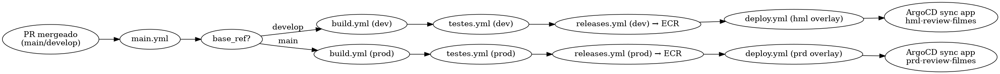

# Review-Filmes — CI/CD com GitHub Actions, Kustomize e EKS

> Aplicação **.NET 8** com **PostgreSQL**, testes (unit, integration e e2e) e pipeline **CI/CD** completa para **Amazon EKS** usando **GitHub Actions** + **Kustomize** (overlays `hml` e `prd`).


---

## 🚦 Fluxo CI/CD (visão geral)

```mermaid
%% Renderiza no GitHub se suportado; fallback PNG abaixo

flowchart LR
  A[PR mergeado para main/develop] --> B[main.yml]
  B --> C{base_ref}
  C --|develop| D[build.yml (dev)]
  C --|main| E[build.yml (prod)]
  D --> F[testes.yml (dev)]
  E --> G[testes.yml (prod)]
  F --> H[releases.yml (dev) → ECR]
  G --> I[releases.yml (prod) → ECR]
  H --> J[deploy.yml (hml overlay)]
  I --> K[deploy.yml (prd overlay)]
  J --> L[ArgoCD sync app hml-review-filmes]
  K --> M[ArgoCD sync app prd-review-filmes]
`````````

```

---

## 🌳 Estrutura do repositório

```
.github/workflows/
├─ main.yml        # Orquestra CI/CD em PR mergeado (develop/main)
├─ build.yml       # build dotnet
├─ testes.yml      # unit + integration + SonarQube
├─ releases.yml    # build/push da imagem no ECR + Trivy (SARIF)
└─ deploy.yml      # update de imagem no overlay + sync ArgoCD

k8s/deploy/
├─ base/
│  ├─ deployment.yaml
│  └─ kustomization.yaml
├─ hml/
│  ├─ ingress.yaml            # host: homolog.app.wsnobrega.life
│  ├─ kustomization.yaml      # image: 216989136189.dkr.ecr.us-east-1.amazonaws.com/hml-review-filmes:<tag>
│  ├─ patch-db.yaml
│  ├─ postgre.yaml
│  ├─ replicas.yaml
│  └─ service.yaml
└─ prd/
   ├─ ingress.yaml            # host: prod.app.wsnobrega.life
   ├─ kustomization.yaml      # image: 216989136189.dkr.ecr.us-east-1.amazonaws.com/prd-review-filmes:<tag>
   ├─ patch-db.yaml
   ├─ postgre.yaml
   ├─ replicas.yaml
   └─ service.yaml

src/
├─ Review-Filmes.Domain/
├─ Review-Filmes.Web/
├─ Review-Filmes.Test.Unit/
├─ Review-Filmes.Test.Integration/
└─ Review-Filmes.Test.EndToEnd/
```

---

## 🔧 Pré‑requisitos

- .NET SDK 8+
- Docker & Docker Compose
- kubectl + kustomize (ou `kubectl kustomize`)
- AWS CLI autenticado
- Cluster **EKS** com **AWS Load Balancer Controller**
- **ArgoCD** acessível em `argocd.app.wsnobrega.life` (ajuste conforme necessário)

---

## 🔐 Secrets & Vars necessários (GitHub)

### Repo/Org **Variables (vars)**
| Nome | Exemplo | Uso |
|---|---|---|
| `AWS_REGION` | `us-east-1` | Região AWS |
| `ID_ACCOUNT` | `216989136189` | Conta AWS usada nos tags do ECR |
| `STAGE` | `dev` ou `prod` | Usado no `run-name`/Sonar e para tag `<stage>-review-filmes` |
| `ECR_REPO_HML` | `216989136189.dkr.ecr.us-east-1.amazonaws.com/hml-review-filmes` | Conveniência |
| `ECR_REPO_PRD` | `216989136189.dkr.ecr.us-east-1.amazonaws.com/prd-review-filmes` | Conveniência |

### Repo/Org **Secrets**
| Nome | Uso |
|---|---|
| `AWS_ACCESS_KEY_ID`, `AWS_SECRET_ACCESS_KEY` | Credenciais para `releases.yml` (se não usar OIDC) |
| `SONAR_HOST_URL`, `SONAR_TOKEN` | Análise SonarQube no `testes.yml` |
| `GIT_USERNAME`, `GIT_PASSWORD` | Deploy atualiza `kustomization.yaml` via push |
| `ARGOCD_TOKEN` | `deploy.yml` faz `argocd login` com admin/token |
| `KUBE_CONFIG` (opcional) | Se optar por kubectl direto em vez de ArgoCD |

> **ECR** utilizados:  
> HML → `216989136189.dkr.ecr.us-east-1.amazonaws.com/hml-review-filmes`  
> PRD → `216989136189.dkr.ecr.us-east-1.amazonaws.com/prd-review-filmes`

---

## 🧪 Testes locais

```bash
dotnet restore
dotnet build -c Release
dotnet test -c Release --collect:"XPlat Code Coverage"
```

## 🐳 Subir local com Docker Compose

`.env` de exemplo:
```env
POSTGRES_DB=review
POSTGRES_USER=review
POSTGRES_PASSWORD=postgrespwd
ASPNETCORE_ENVIRONMENT=Development
ConnectionStrings__Default=Host=postgres;Database=review;Username=review;Password=postgrespwd
```

```bash
docker compose up -d --build
# http://localhost:8080
```

## 🏷️ Imagem e tags

`releases.yml` cria 3 tags por execução: `latest`, `${{ github.run_number }}` e `SHORT_SHA`.
Essas tags são aplicadas nos repositórios do ECR por ambiente:

- HML: `hml-review-filmes`
- PRD: `prd-review-filmes`

---

## ☸️ Namespaces e Ingress

Namespaces usados no cluster:
- `hml-reviewfilmes`
- `prd-reviewfilmes`

Ingress hosts:
- HML → `homolog.app.wsnobrega.life`
- PRD → `prod.app.wsnobrega.life`

Criação (uma vez):
```bash
kubectl create ns hml-reviewfilmes || true
kubectl create ns prd-reviewfilmes || true
```

### Deploy manual (debug)
```bash
kubectl apply -k k8s/deploy/hml -n hml-reviewfilmes
kubectl apply -k k8s/deploy/prd -n prd-reviewfilmes
kubectl rollout status deploy/<nome-do-deployment> -n <ns>
```

---

## 🚀 Disparo do CI/CD

- **CI/CD automático**: quando um **PR é *mergeado*** para `develop` (→ *hml*) ou `main` (→ *prd*), o `main.yml` orquestra:
  1) `build.yml` → 2) `testes.yml` (unit+integration+Sonar) → 3) `releases.yml` (ECR + Trivy SARIF) → 4) `deploy.yml` (atualiza overlay e `argocd app sync`).

- **Manual**: `workflow_dispatch` em `main.yml` permite rodar sob demanda.

---

## 📦 Trivy + SARIF

`releases.yml` gera `trivy-docker-result.sarif` e envia para:
```
s3://artefatos-pipeline-216989136189/${{ vars.STAGE }}-review-filmes/${{ vars.STAGE }}-review-filmes-${{ github.run_number }}.sarif
```

---

## 🧭 Dicas e Troubleshooting

- **Imagem ainda com `:latest`** após deploy: o `deploy.yml` valida a renderização do Kustomize; se detectar `:latest`, falha o job (garante tag imutável).
- **Qualidade Sonar**: verificação do *Quality Gate* é exibida no final do job `sonarqube`.
- **ArgoCD**: os apps esperados são `hml-review-filmes` e `prd-review-filmes` (ou ajuste `ARGOCD_APP_NAME`/prefixo no `deploy.yml`).

---

## 👥 Contribuição

1. `git checkout -b feature/minha-feature`
2. Commits semânticos
3. Abra PR para `develop` (hml) ou `main` (prd)

## 📄 Licença

MIT (ou a de sua preferência).
